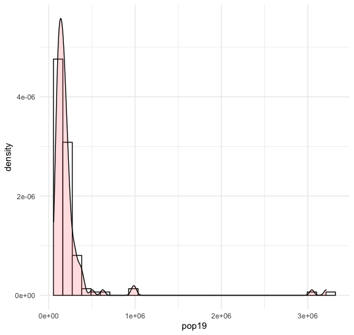
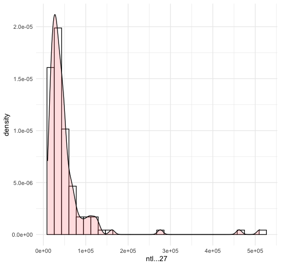
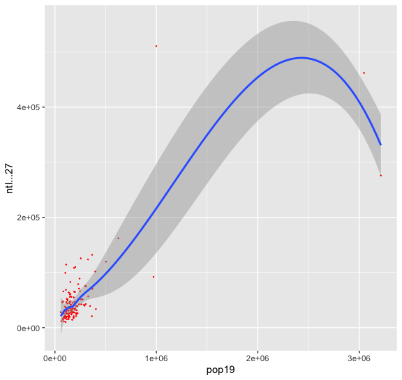
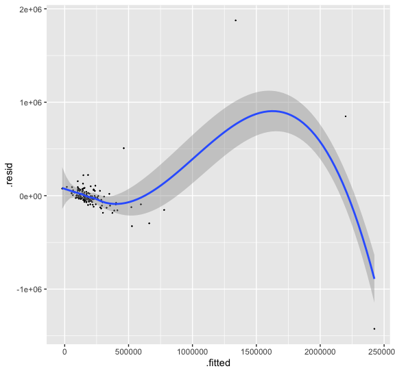
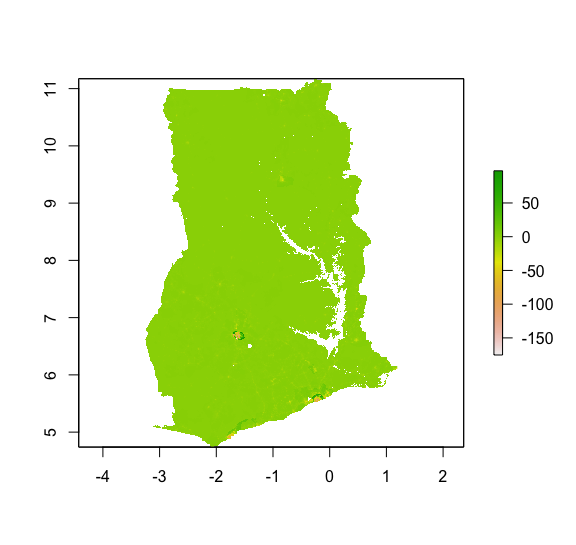
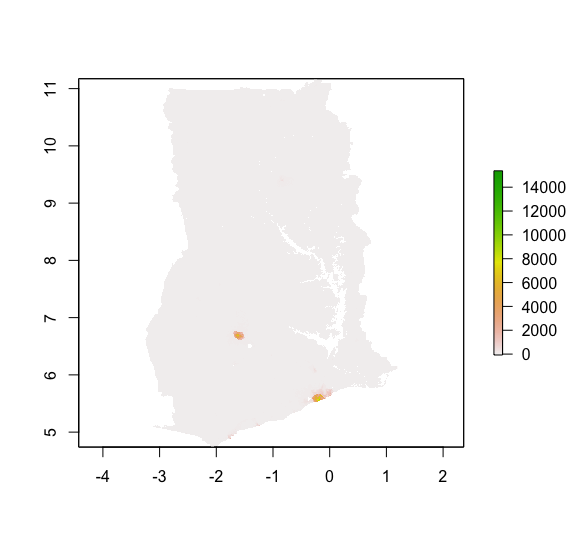
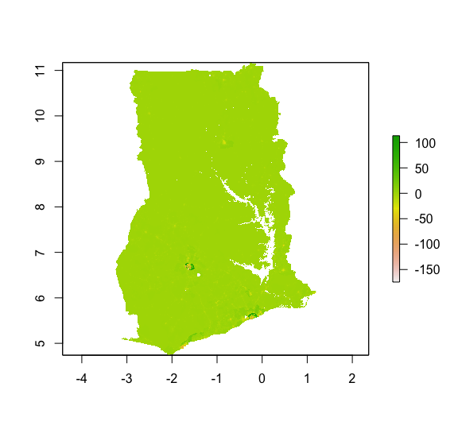
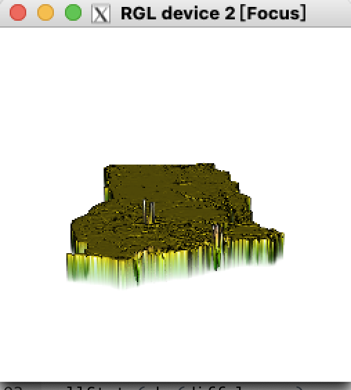
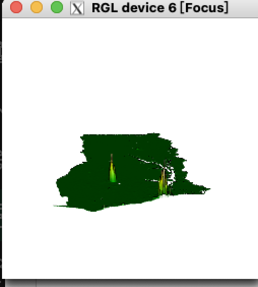
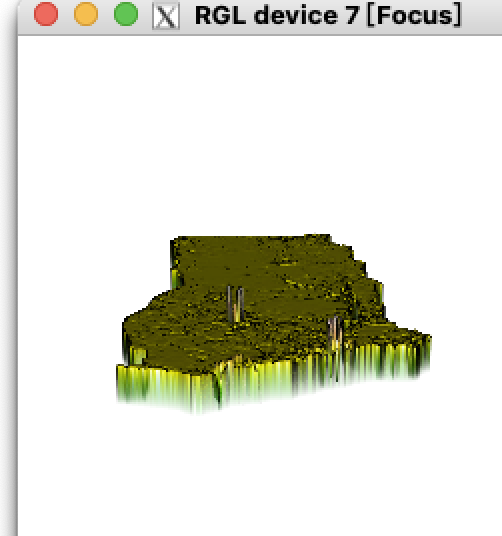

# Self-introduction

My name is Peter and I am a WM 2024 student from, I intend to major in Mathematics or Business.

# Project1

https://github.com/Peterzzzwwww/Data100repository/blob/main/project1.1.R

#DS Reflection1

https://github.com/Peterzzzwwww/Data100repository/blob/main/DS%20Reflection%231

In contemporary society, the development of data science has been closely connected with our daily life. Among Blumenstock’s statement, he pointed out a kind of data-analyzing tool and discussed about its theory and the prospective of development. 

Blumenstock mentioned that through the tracking of  ‘digital signature’, people could be able to track the path of the digital footprints and make it more efficient to allocate resources. However, this kind of data tracking may also have its drawback because these data may be biased because generally the utilizing of data is easier for the richer people comparing with the poor, this would even expand the gap of wealth between classes. 

Blumenstock also mentions the potential solutions such as people could make the utilize of data more structured and more customized learning algorithm would be used. This kind of solution may not radically altered the utilizing of digital signature, but in generally, this would help to create a humbler data science. 

Under the influence of COVID-19, the improvement of digital signature have become increasingly important, as this could help us to closely track the spreading of virus and make our allocation of anti-epidemic resource more effective.# Project2

#Population

#plots

# DS Reflection2

https://github.com/Peterzzzwwww/Data100repository/blob/main/ds%20reflection2.pages
Rob Kitchin analyzed the complex situation we have faced under the circumstance of the increasingly expansion of the influence of big data. He illustrated several ways that big data would influence our daily life such as gathering data from social media and influences on decision making. What is most important is that he also mentioned the revolution big data might brought to the field of science. 

Rob mentioned that Big data have brought us a “new model of science” which will contributes a lot for the connection among different subjects. Certainly that is caused by several merits of Big data. Big data is able to bring us a God’s eye view that is extremely efficient and help people to give out a comprehensive understanding of what is happening on a specific event. Additionally, under properly control, people could easily gather Big data and utilize it through the way we want. As mentioned in the article, data would “speak for themselves”, that means people could easily control it, and we can interpret it under different perspectives until we find out the one which is helpful to us. We are lucky to own such a strong and controllable tool.

However, people have generate different perspectives regarding Big data. As mentioned that there is potential risk that big data would not be a good analyzer of literature. It would just simply transforming letters into data and not impose any “sense of emotion” on it. It is commented that this kind of work would be better if they are done by human being rather than machines. As the example shows that even though a map may show the patterns of a city, it may not have the ability to explain and analyze it. 

# Project 3

# Ds reflection 3

https://github.com/Peterzzzwwww/Data100repository/blob/main/ds%20reflection3.docx

He defines development as a progressing process that contains several steps and emphasizes much on freedom. He extended to Amartya Sen’s definition that development would be regarded as a property of continuously economic increase rather than simply emphasize the positive change on a specific people. 

The toaster project is an experiment that Thomas decided to make a simple toaster with all original materials. He did not success at last as even building such a simple product would cost much more money than he expect and his creature broke into pieces soon after he built it. His experiment reflected that every wouldn’t be simple if we break it down into pieces. Not to mention such a huge project of building a economic system.

The economic models give a comprehensive view on multiple aspects of the economic growth among past 50 years, it shows that we are experiencing a rapidly growth period and the models would contain more details such as politics and technologies. 

Steve Jones is an evolutionary biologist. At uni-lever he worked to test several groups of nozzles in order to design a form of nozzle that work the best. He reach a great success that the new nozzle is 100 times more efficient than the original edition. It would give out “game-changing” results because of such a huge improvement. 

A complex adaptive system is the phenomena that under a circumstance things would interact frequently and involving with each other. The complex adaptive system is hard to predict in detail as it is happened in a non linear system. It also have emergent properties that is not linked to any individual agent and it tends towards greater complexity. 

Haile Sellasie was the last emperor of the great feudal dynasty of Ethiopia. The Emperor period of Ethiopia gives out a good example that the resource and power are all controlled the elites, and they would resist any kind of revolution that would potentially threat their power. This would obviously restrain the development of the country and cause negative effects. 

Barder appeal to resist engineering because some evolutionary process which is likely to seem unprecedented are easy to make bigger influence than designed progress, and also in a non linear system we are hard to predict what’s going to happen.  Isomorphic mimicry means that in order to show people that their is a powerful institution that can enforce the law rather then build one that can really do so. 

Resist fatalism means that we do not have to just do nothing and wait for time to chose the most proper solution, indeed we can positively choose the way we want. Norman Borlaug is a famous biologist that start the Green Revolution, which controls the mutate of the genes of paddy and finally effectively remit the scarcity of rice.

# Project 4

# DS Reflection 4
https://github.com/Peterzzzwwww/Data100repository/blob/main/ds%20reflection%204.pages
![]

West mentions that scaling could be used in the study of cities’s utilize of resources, which could give sufficient help to analyze the allocation of natural resources and material resources in the cities in order to find out the most sufficient way to build a city that is most idealized. Also through putting different variances in the chart and “scale” different cities, it would offer us a intuitive sight of which city and show us how unique they are. 

We could also use scaling to give out a data analyze of the transmit of information in the city. This provides us a different angel of view for the cities, as under the huge frame of cities, we could see the exchange of information through social networks, which not only transmit information but also create wealth and brought out numerous new ideas. By scaling, we could analyze how fast different information, in other ways we could call them data, transmit, which could help us better understand how the data transmission works. 

Scaling is also utilized in the study of social network. By analyzing our social network and connection with different people among us, we could easily understand the level of intimacy of our friends, which one is our closer friend and who is unfamiliar?  By studying different group sizes of people we could have a more comprehensive understand to the social network. 

West mentions that big data could become increasingly essential among variance areas of study and it would also challenge the traditional view of science, as data provided us a new way for understanding the world. 

According to West, theories could not be relevant in the face of big data. For example, Theory of Everything, even it seems extremely comprehensive but it indeed looks surprisingly simple under the scale of universe and it could not explain everything. 
