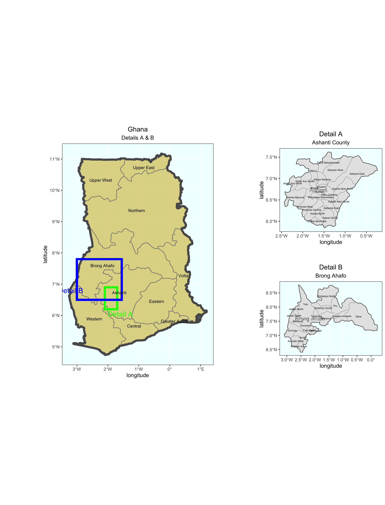
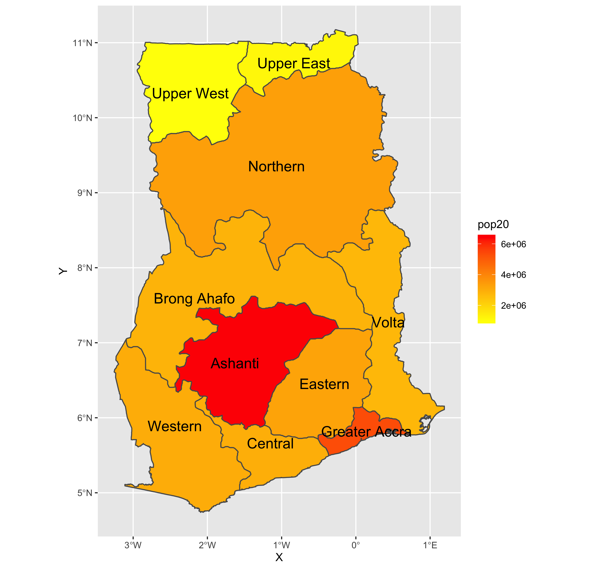
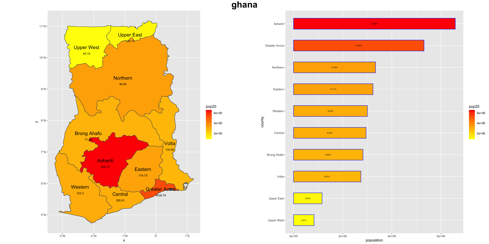
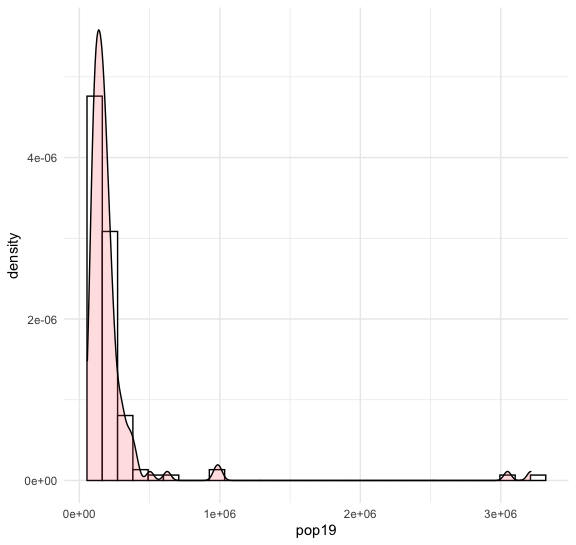
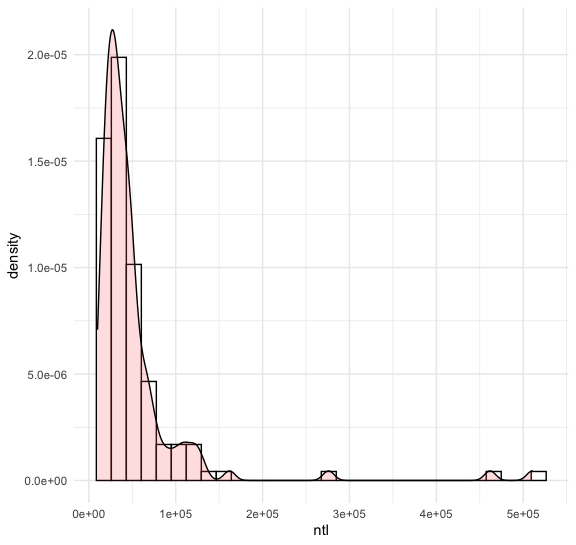

# Self-introduction

My name is Peter and I am a WM 2024 student from, I intend to major in Mathematics or Business.

# Project1

https://github.com/Peterzzzwwww/Data100repository/blob/main/project1.1.R

#DS Reflection1

https://github.com/Peterzzzwwww/Data100repository/blob/main/DS%20Reflection%231

In contemporary society, the development of data science has been closely connected with our daily life. Among Blumenstock’s statement, he pointed out a kind of data-analyzing tool and discussed about its theory and the prospective of development. 

Blumenstock mentioned that through the tracking of  ‘digital signature’, people could be able to track the path of the digital footprints and make it more efficient to allocate resources. However, this kind of data tracking may also have its drawback because these data may be biased because generally the utilizing of data is easier for the richer people comparing with the poor, this would even expand the gap of wealth between classes. 

Blumenstock also mentions the potential solutions such as people could make the utilize of data more structured and more customized learning algorithm would be used. This kind of solution may not radically altered the utilizing of digital signature, but in generally, this would help to create a humbler data science. 

Under the influence of COVID-19, the improvement of digital signature have become increasingly important, as this could help us to closely track the spreading of virus and make our allocation of anti-epidemic resource more effective.# Project2

#Population

#plots

# DS Reflection2

https://github.com/Peterzzzwwww/Data100repository/blob/main/ds%20reflection2.pages
Rob Kitchin analyzed the complex situation we have faced under the circumstance of the increasingly expansion of the influence of big data. He illustrated several ways that big data would influence our daily life such as gathering data from social media and influences on decision making. What is most important is that he also mentioned the revolution big data might brought to the field of science. 

Rob mentioned that Big data have brought us a “new model of science” which will contributes a lot for the connection among different subjects. Certainly that is caused by several merits of Big data. Big data is able to bring us a God’s eye view that is extremely efficient and help people to give out a comprehensive understanding of what is happening on a specific event. Additionally, under properly control, people could easily gather Big data and utilize it through the way we want. As mentioned in the article, data would “speak for themselves”, that means people could easily control it, and we can interpret it under different perspectives until we find out the one which is helpful to us. We are lucky to own such a strong and controllable tool.

However, people have generate different perspectives regarding Big data. As mentioned that there is potential risk that big data would not be a good analyzer of literature. It would just simply transforming letters into data and not impose any “sense of emotion” on it. It is commented that this kind of work would be better if they are done by human being rather than machines. As the example shows that even though a map may show the patterns of a city, it may not have the ability to explain and analyze it. 

# Project 3

#challange question1

